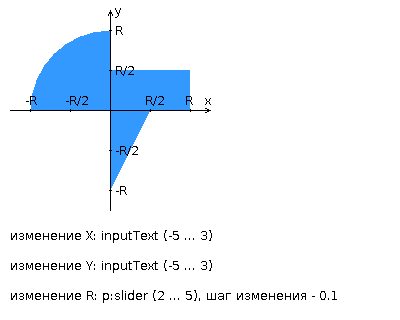

# Разработать приложение на базе JavaServer Faces Framework, которое осуществляет проверку попадания точки в заданную область на координатной плоскости.

## Приложение должно включать в себя 2 facelets-шаблона - стартовую страницу и основную страницу приложения, а также набор управляемых бинов (managed beans), реализующих логику на стороне сервера.

### Стартовая страница должна содержать следующие элементы:

* "Шапку", содержащую ФИО студента, номер группы и номер варианта.
* Интерактивные часы, показывающие текущие дату и время, обновляющиеся раз в 12 секунд.
* Ссылку, позволяющую перейти на основную страницу приложения.

### Основная страница приложения должна содержать следующие элементы:

* Набор компонентов для задания координат точки и радиуса области в соответствии с вариантом задания. Может потребоваться использование дополнительных библиотек компонентов - ICEfaces (префикс "ace") и PrimeFaces (префикс "p"). Если компонент допускает ввод заведомо некорректных данных (таких, например, как буквы в координатах точки или отрицательный радиус), то приложение должно осуществлять их валидацию.
* Динамически обновляемую картинку, изображающую область на координатной плоскости в соответствии с номером варианта и точки, координаты которых были заданы пользователем. Клик по картинке должен инициировать сценарий, осуществляющий определение координат новой точки и отправку их на сервер для проверки её попадания в область. Цвет точек должен зависить от факта попадания / непопадания в область. Смена радиуса также должна инициировать перерисовку картинки.
* Таблицу со списком результатов предыдущих проверок. 
* Ссылку, позволяющую вернуться на стартовую страницу.

### Дополнительные требования к приложению:

* Все результаты проверки должны сохраняться в базе данных под управлением СУБД PostgreSQL.
* Для доступа к БД необходимо использовать ORM Hibernate.
* Для управления списком результатов должен использоваться Session-scoped Managed Bean.
* Конфигурация управляемых бинов должна быть задана с помощью параметров в конфигурационном файле.
* Правила навигации между страницами приложения должны быть заданы в отдельном конфигурационном файле.

---

# Для своей программы из лабораторной работы #3 по дисциплине "Веб-программирование" реализовать:

* MBean, считающий общее число установленных пользователем точек, а также число точек, попадающих в область. В случае, если пользователь совершил 2 "промаха" подряд, разработанный MBean должен отправлять оповещение об этом событии.
* MBean, определяющий площадь получившейся фигуры.

## С помощью утилиты JConsole провести мониторинг программы:

* Снять показания MBean-классов, разработанных в ходе выполнения задания 1.
* Определить наименование и версию JVM, поставщика виртуальной машины Java и номер её сборки.

## С помощью утилиты VisualVM провести мониторинг и профилирование программы:

* Снять график изменения показаний MBean-классов, разработанных в ходе выполнения задания 1, с течением времени.
* Определить имя класса, объекты которого занимают наибольший объём памяти JVM; определить пользовательский класс, в экземплярах которого находятся эти объекты.

## С помощью утилиты VisualVM и профилировщика IDE NetBeans, Eclipse или Idea локализовать и устранить проблемы с производительностью в программе. По результатам локализации и устранения проблемы необходимо составить отчёт, в котором должна содержаться следующая информация:

* Описание выявленной проблемы.
* Описание путей устранения выявленной проблемы.
* Подробное (со скриншотами) описание алгоритма действий, который позволил выявить и локализовать проблему.

#### Студент должен обеспечить возможность воспроизведения процесса поиска и локализации проблемы по требованию преподавателя.
